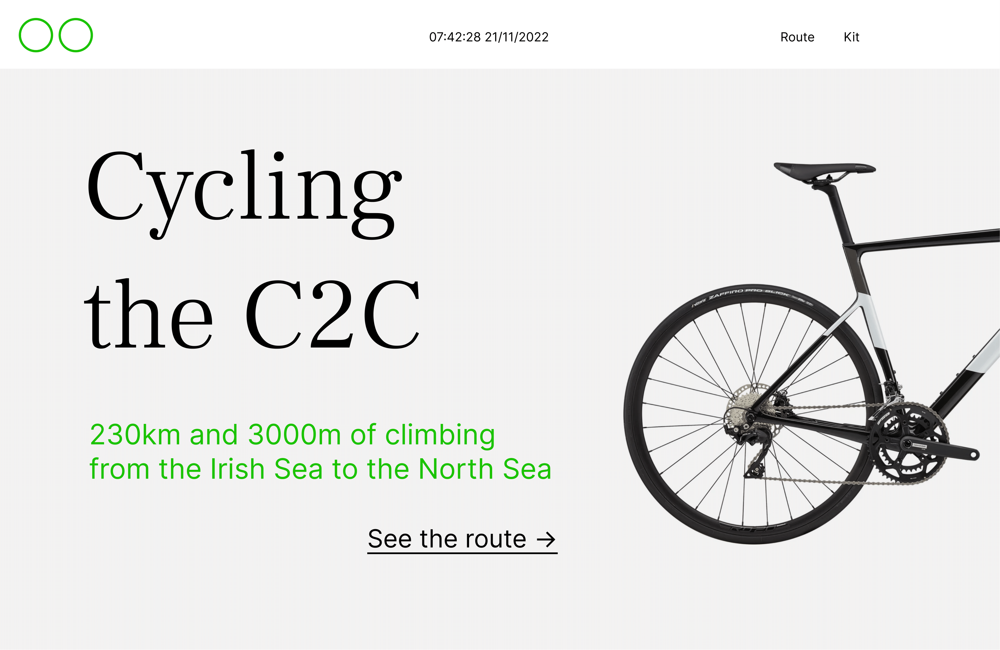
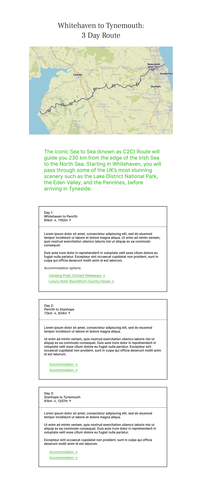
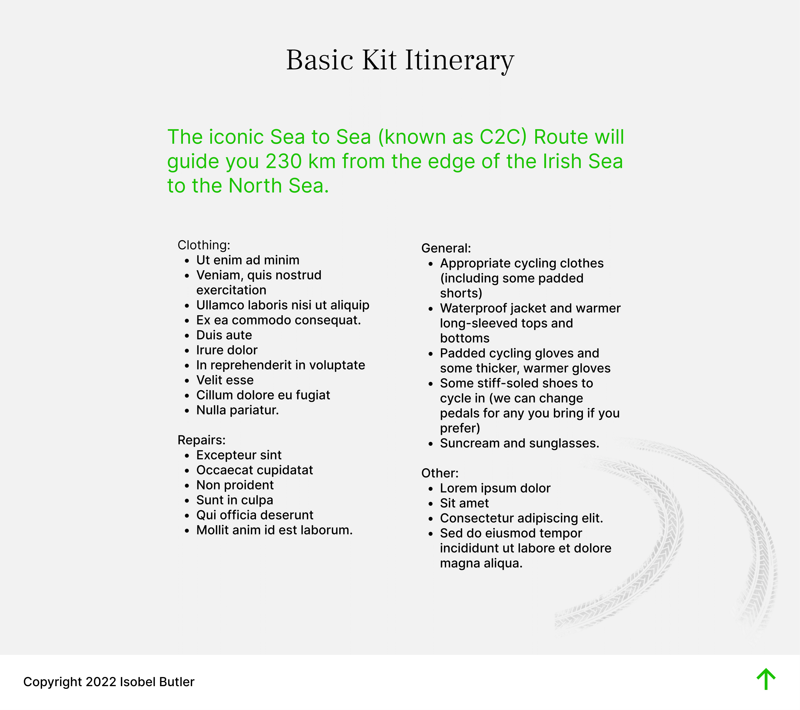

# Hobby Page

## Table of Contents
1. [Planning](#Planning)
2. [Building](#Building)
3. [Debugging](#Debugging)

## Planning

I decided to create a website about cycling and landed on the idea of creating a guide to cycling the Coast to Coast challenge, which I'm hoping to cycle later this year. I decided I would split the website into an opening section containing a title and short subtitle, a route section, and a kitlist section.

I like to have a fairly thorough design of a website before building as I find it makes things alot quicker, helps me know where to start, and means I can play with the design without spending extra time fiddling with code. 

I created the design on Figma, as shown below:  





## Building

I enjoyed making this project, I was already fairly familiar with HTML and CSS from when I self-taught myself, but knew that I needed to revisit it as my knowledge felt like it wasn't necessarily all joined together. Before starting this project I worked through most of the HTML and CSS sections of a Front-End Development course by Treehouse. This meant I found the building of the page fairly straight forward and so focused on trying to build it in a clean, logical manner.

1. Convert Figma design to a skeleton HTML layout.
  - Header/Navbar
  - Introduction
  - Route 
    - Day 1 Box
    - Day 2 Box
    - Day 3 Box
  - Kit List
  - Footer
2. Add styling to make replicate the Figma design.
  - Simple grid layout for the *.route_boxes*.
  - Padding to all sections.
  - Link Google Fonts.
  - Section specific styling e.g. background colours, extra padding, borders.
3. Make Header fixed upon scroll.
4. Add JS clock.
5. Add images that sit outside the flow of the page.
  - Tire tracks in Kit List.
  - Bike in Introduction.
6. Add Media Queries so compatible with different screen sizes.
7. Add images to each day of the route.
8. Replace the route description *ipsum lorem* with proper copy.  


## Debugging


### Issue: 
#### 1. Getting images to sit exactly where I wanted on page.
#### 2. Getting image background to appear transparent.

I wanted to have faint tire tracks sit behind the text of the kit list to give a bit of interest to the section, and also a bike in the introduction section. I couldn't figure out how to get them to sit outside of the section and not be affected by the padding. I researched online and realised I could use absolute positioning to fix them exactly where I wanted. 

I also discovered that rather than editing the bike image to remove the white background, I could use CSS. I played with the various *mix-blend-mode* choices and found that multiply made the background nice and transparent. 

**Solution:**

```CSS
  #intro img {
    width: 30%;
    mix-blend-mode: multiply; /* makes img background same as page */
    position: absolute; 
    top: 25%;
    right: 0;
  }
```

I used absolute positioning on the *#intro img* first which is at the start of the page. When I came to do the tire tracks in the last section, *position: absolute* wasn't having the effect I hoped for and the tire tracks would appear at the beginning of the page. I again looked online and realised that I needed to add positioning to the parent container of the images section so that the tire tracks would be positioned in relation to the section:

```
#itinerary {
    width: 60%;
    margin: auto;
    position: relative;
  }

#trackmarks {
    opacity: 0.15;
    width: 450px;
    position: absolute;
    bottom: 0;
    right: 0;
  }
```

### Issue: Getting the date to display as XX/XX/XXXX.

I found how to get the clock working fairly easily but couldn't find a way to get it so that the date would appear with a 0 prefix, such as if it was the 2nd of March, it would appear as 2/3/2023, rather than 02/03/2023. I decided to make an *else if* clause that would use *string interpolation* to affix a 0 to a day if a single digit date, and the same for the month. I much preferred how this looked on the page.

**Original code:**
```javascript
const date = new Date();

let day = date.getDate();
let month = date.getMonth() + 1; // You need + 1 as month is seen as 0-11.
let year = date.getFullYear();
let headingDate = `${day} / ${month} / ${year}`;

```

**Solution:**

```javascript
if ( day <= 9 & month >= 10) {
    headingDate = `0${day} / ${month} / ${year}`;
}  else if ( day >= 10 & month <= 9 ) {
    headingDate = `${day} / 0${month} / ${year}`;
}  else if ( day <= 9 & month <= 9) {
    headingDate = `0${day} / 0${month} / ${year}`;
}  
```

### Issue: Getting some links centered in the navbar and others aligned left and right.

I made a flexbar navbar and wanted to left align the logo, center the links, and right align the JS date. I couldn't figure out how to do this without setting fixed widths on each element. 

Eventually I landed on a neat trick of setting *margin-left: auto* on the first of the centered links, and the JS date, this created exactly what I was after, without having to use fixed-widths. Without *margin-left*, the links would all be left aligned by default.

**Solution:**

```css
#topnav {
    width: 100%;
    position: fixed;
    background-color: #fff;
    z-index: 99; 
    display: flex;
    align-items: center;    
  }

.nav-link, #clock {
    margin-left: auto; /* great little way to align #clock center and .nav-link right  */ 
  }
```

